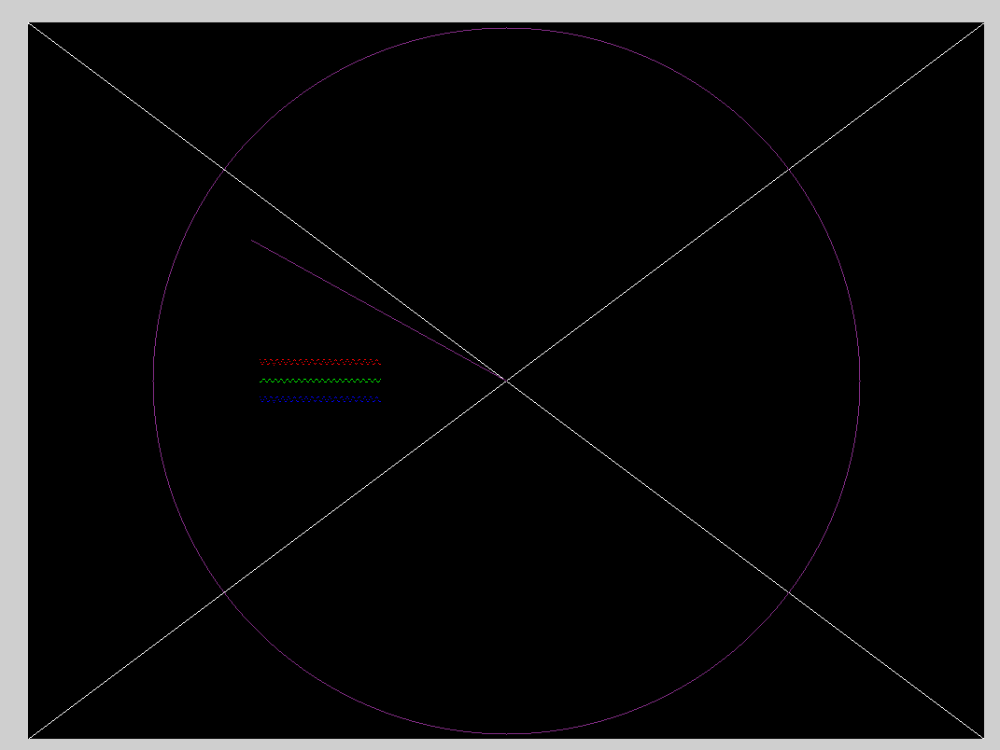

# wefx

Wefx is a graphics library for drawing simple things using C, wasm, and an
HTML canvas. It aims to be similar to [gfx][gfx] - it is meant to be a
teaching / learning tool for C and graphics. This is not using OpenGL /
WebGL or anything like that. It is doing very basic pixel manipulation and
has very simple functions to draw pixels and lines.

[Video of the project in action](https://www.youtube.com/watch?v=vrqixVOd-rc)



## Using The Project

The basic flow of how the project works has two steps: the build step, and
the serve step:

```
 Build
 ⌈                    ⌉             ⌈                   ⌉
 | ./src + ./examples | ⭢  clang ⭢ | ./build/wefx.wasm |
 ⌊                    ⌋             ⌊                   ⌋
                                             ⭣
        _____________________________________/
       /
      ⭣
 ⌈          ⌉                  ⌈         ⌉    ⌈      ⌉
 | ./build/ | ⭢  web server ⭢ | browser | ⭢ | you! |
 ⌊          ⌋                  ⌊         ⌋    ⌊      ⌋
 Serve
```

In other words, you compile the C code into a wasm, and then serve the
`build` directory using a web server. You can then open a web browser and
visit http://localhost:8000 view the running C code.

You'll need the following programs installed:

- clang 
- make (optional - MacOS and Linux)
- (optional) python3

On MacOS or Linux these tools should be available already, or easily
installed with homebrew (`brew install`), or Apt (`apt install`), or your local package
manager.

### Compiling

To understand what is happening (or if you do not want to use _make_), open
the _Makefile_ file and look at the _build_ task. There you can see how
_clang_ is used.

If you have _make_ available, type:

```
make build
```

on the command line. This will, assuming there are no errors, create the
file `./build/wefx.wasm`. Once this builds you can serve your creation by
doing the following...

### Serving

The gist of this is you need to serve the contents of the `/build`
directory in a web server. You need to do this because the file that loads
the newly create `wasm` file ([index.html](./public/index.html) can only
load the wasm file over http. You can not simply open the `index.html` file
directly from your file system (this is just how wasm loading works).

If you try to open the `index.html` file directly you will get an error
like:

```
Cross-Origin Request Blocked: The Same Origin Policy disallows reading the remote resource at file:///xxxxx/build/wefx.wasm. (Reason: CORS request not http).
```

A basic http server comes with python3, and the make file will run that
server if you run:

```
make serve
``` 

and the python3 web server will serve the files in the _build_ directory.
You can then use your favourite browser and browse to http://localhost:8000
to see the compiled code.

---

**Note** `make serve` will both recompile your code and run the web server.

---

If you already have a favourite server (for example I use
[busboy](https://github.com/robrohan/busboy)), you can use that serve to
serve the `build` directory instead, and then run the `make build` command
to replace the wasm file as you play around.

For example in one shell I run:

```
busyboy --root=./build
```

Then, after I make changes to the C code, I run

```
make build
```

And then simply refresh the browser to see changes.

### Writing Code

If just teaching / learning about graphics, you'll only need to edit the
[./examples/example0.c](./examples/example0.c) file. There are two entry
points into that file:

```
void init()                    - called once at the start of the app
void main_loop(float time)     - called every frame with time being time since app start
```

You can also add your own files into the examples directory and then pass
the MAIN variable to make:

```
make build MAIN=examples/example1.c
```

That will build the wasm file using `example1.c` as the entry point.

#### API

The API calls try to emulate [gfx][gfx] as much as possible. Here are the
currently supported functions:

```
wefx_open(int width, height, char *title)
wefx_point(x, y)
wefx_line(int x1, y1, x2, y2)
wefx_color(int red, green, blue)
wefx_clear()
wefx_clear_color(int red, green, blue)
```

### Windows

I have run this on Windows, but you should be able to build it with Visual
Studio. You will have to install `clang` as an add on, and then setup the
build flags to the ones shown in the `Makefile`.

[gfx]: https://www3.nd.edu/~dthain/courses/cse20211/fall2013/gfx/
